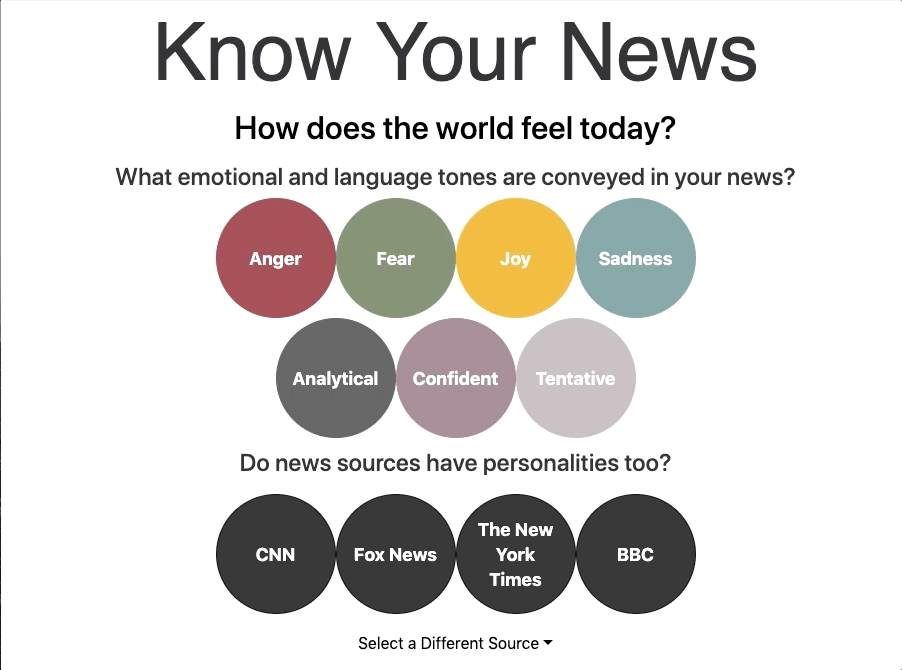

# News By Mood

The goal behind News By Mood was to understand how news articles can elicit specific emotional responses within their readers and give these readers an “emotional profile” of the article beforehand. It also provides users with a "source personality" of each source found on the website, which is meant to be a snapshot of the kinds of tones found in articles written by that source. 

## Live on newsbymood.com

Deployed using Amazon Web Services And Google Domains

## Technologies Used

APIs: News API, IBM Watson Tone Analyzer
Python, Javascript, React, Flask, AJAX, JQuery, Webpack, Postgres, SQL Alchemy, Chart.js, Beautiful Soup, Bootstrap, CSS.

## How It Works

### Toolbar
Made with react-bootstrap

### Popovers
Made using the Popover component from the reactstrap module
Meanings of Tones as described by the IBM API

### News Articles
Bubblechart using @weknow/react-bubble-chart-d3 and Pagination with the help of the following tutorial- https://scotch.io/tutorials/build-custom-pagination-with-react

### Source Personalities
Pie charts using react-chartjs-2

### Phone Mode
Responsive sizing with react-bootstrap and lots of media queries

### Hope you liked my website!

